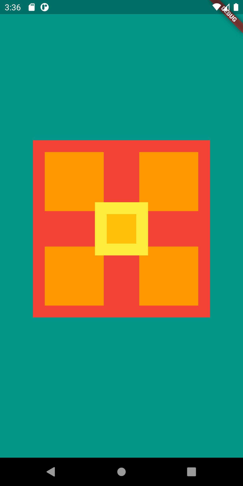

# Desafio de Layout mundo_flutter

## Execução

Para executar este projeto, basta clonar o repositório, executar na raiz do diretório o comando "pub get" para download dos pacotes e executá-lo em um emulador ou dispositivo físico
